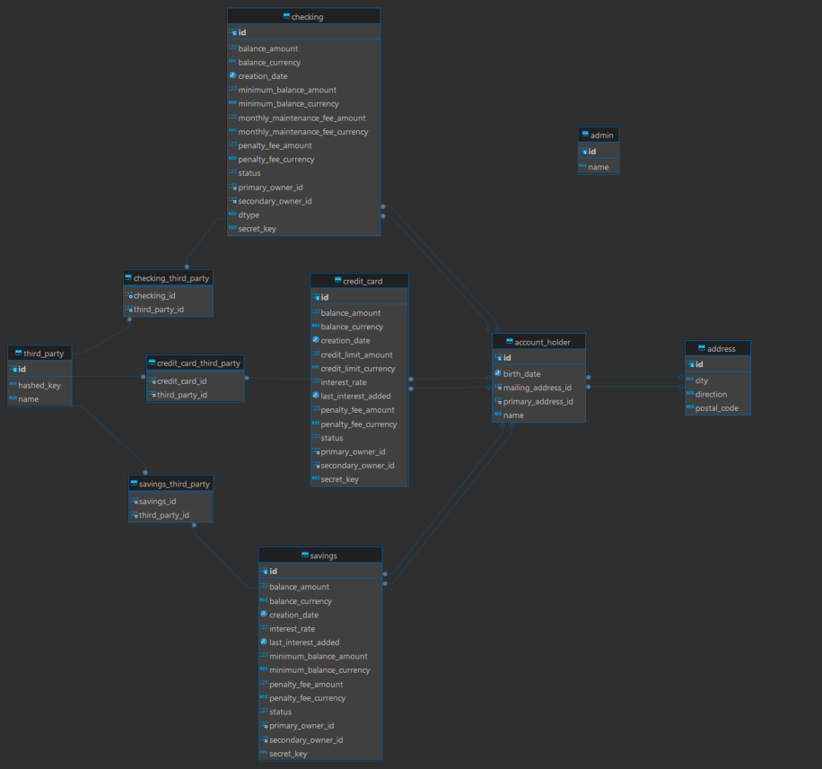

# Iron Bank - Java Spring Application

## Descripción del Proyecto

**Iron Bank** es una aplicación bancaria diseñada como parte de un ejercicio académico para familiarizarse con el framework **Spring Boot** y la arquitectura de aplicaciones RESTful. El objetivo principal del proyecto es manejar diferentes tipos de usuarios y cuentas bancarias, permitiendo gestionar balances, aplicar intereses y realizar operaciones CRUD (Crear, Leer, Actualizar, Eliminar) sobre estos recursos.

El proyecto fue desarrollado siguiendo el enfoque de buenas prácticas de diseño de software, con una estructura de capas que incluye Modelos, Controladores, Servicios y Repositorios.

## Proceso de Desarrollo

### 1. Decisión del Tema
El proyecto de IronBank fue seleccionado entre otras temáticas por ser el ejemplo propuesto por el curso. Dado que Spring nos presentó varios desafíos desde el principio, optamos por un tema que no nos exigiera invertir demasiado tiempo en la conceptualización y nos permitiera concentrarnos en aprender las herramientas y superar los obstáculos técnicos.

### 2. Configuración Inicial
El proyecto fue inicializado usando **Spring Initializr**, y se configuraron las dependencias básicas necesarias, como Spring Data JPA y MySQL Server para persistencia en memoria.

### 3. Modelado de Clases
Comenzamos creando dos superclases principales:
- **User**: Clase padre que representa a los usuarios del sistema.
- **Account**: Clase padre que representa las cuentas bancarias.

De estas superclases derivan varias subclases:
- Usuarios: `AccountHolder`, `Admin`, `ThirdParty`
- Cuentas: `Checking`, `Savings`, `StudentChecking`, `CreditCard`

También se crearon otras clases auxiliares como **Money** (para manejar valores monetarios) y **Address** (para la dirección de los usuarios). Estos se usaron como atributos en otras entidades.

### 4. Estructura de Carpetas y CRUD Básico
Después de los modelos, se crearon las carpetas **Controller**, **Service**, y **Repository**. Para cada modelo, implementamos un CRUD básico, copiando las funciones comunes entre los controladores y servicios, ajustando los nombres para que coincidieran con las entidades respectivas.

### 5. Ajustes y Problemas con Relaciones
Durante el proceso de modelado, surgieron problemas con las relaciones entre entidades, especialmente al intentar gestionar las reglas específicas para cuentas, como el `interestRate` de las cuentas de ahorro. Esto provocó varios errores que fueron depurados modificando las relaciones en las entidades.

### 6. Lógica Compleja: Aplicación de Intereses
Uno de los retos más importantes fue la implementación de la lógica de intereses. Se diseñaron nuevas funcionalidades para aplicar los intereses automáticamente al consultar el balance de las cuentas de ahorro y tarjetas de crédito. Para esto, se añadieron endpoints en los controladores y se desarrolló lógica compleja en los servicios.

### 7. Pruebas Unitarias
Para asegurar la correcta implementación de la lógica, realizamos pruebas unitarias sobre el `SavingsService` y el `CreditCardController`, que manejan las partes más complejas del proyecto. Las pruebas unitarias garantizan que:
- Los endpoints funcionan como se espera.
- La lógica de cálculo de intereses se aplica correctamente.

A pesar de esto, encontramos dificultades a la hora de elegir cómo ampliar la cobertura de pruebas, por lo que limitamos la cantidad de casos testeados.

### 8. Problemas de Seguridad
En un esfuerzo por agregar seguridad a la aplicación, tratamos de implementar un sistema de autenticación y autorización. Sin embargo, debido a la falta de tiempo y a la complejidad de los errores que surgieron, decidimos revertir los cambios relacionados con seguridad. La aplicación se entrega como una versión funcional, aunque sin mecanismos de seguridad implementados.

## Tecnologías Utilizadas

- **Java 17**
- **Spring Boot**
- **MySQL**
- **Maven**
- **JUnit 5 & Mockito** (para pruebas unitarias)
- **Postman** (para pruebas de endpoints)

## Problemas Encontrados

- **Dificultades con Spring**: Spring presentó varios retos durante el desarrollo, especialmente en cuanto a las relaciones entre entidades y la configuración de servicios.
- **Lógica de Intereses**: Implementar correctamente el cálculo y aplicación automática de intereses fue una de las tareas más desafiantes, no por su lógica en sí misma sino por ser la primera vez que usábamos Spring para implementarla.
- **Cobertura de Pruebas**: Aunque se realizaron pruebas unitarias, no se alcanzó una cobertura completa debido a la complejidad de algunas operaciones y a la falta de controladores y servicios complejos que testear.
- **Seguridad**: La implementación de seguridad fue compleja y terminó por ser removida para entregar una versión estable.

## Conclusión

A pesar de las dificultades encontradas, **Iron Bank** es un proyecto funcional que cubre la mayoría de los requisitos propuestos por el curso. Se han aprendido muchas lecciones sobre el uso de **Spring Boot**, el manejo de relaciones en bases de datos y la estructura de aplicaciones RESTful.